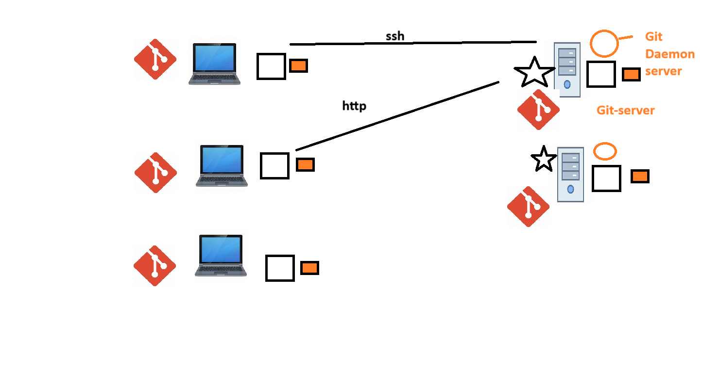

## 🧠 Git – 101

## 🔍 What is Git?

**Git** is a **Version Control System (VCS)** that helps developers **track changes**, **collaborate**, and **manage source code**.

Created by **Linus Torvalds** in 2005 to manage the **Linux kernel**, Git is now the most popular VCS in the world.

---

## 🧩 Why Use Git?

Git helps you:

* 👥 Work with multiple developers on the same project.
* 🕓 Track changes over time (versioning).
* 🔄 Roll back to previous versions if something breaks.
* 📦 Organize features and bug fixes using **branches**.

---

## 🏗️ Git Architecture: 3 Main Areas

1. **Working Directory (Tree)**
   Where you create/edit files.

2. **Staging Area (Index)**
   Where you prepare files before saving them to the repo.

3. **Local Repository**
   Where your changes (commits) are stored with history.

---

## 🔁 Basic Git Workflow

```bash
# 1. Check what has changed
git status

# 2. Stage the file(s)
git add filename     # or use `git add .` for all files

# 3. Commit the changes
git commit -m "Meaningful message"
```
---

## 🧾 Configuring Git

Before using Git, set your identity:

```bash
git config --global user.name "Your Name"
git config --global user.email "you@example.com"
```

You can also set project-specific config using `--local`.

---

## 💡 Git Concepts

| Term       | Meaning                                                    |
| ---------- | ---------------------------------------------------------- |
| Repository | A folder where Git tracks changes (can be local or remote) |
| Commit     | A snapshot of your code changes, like saving your progress |
| Branch     | A separate line of development                             |
| Merge      | Combine changes from different branches                    |
| Checkout   | Switch to a different branch or commit                     |
| HEAD       | A pointer to the latest commit in your current branch      |
| SHA256     | Git uses this to generate unique commit IDs                |

---

## 🌍 Distributed Version Control

Git is **distributed** – everyone has a complete copy of the codebase.
This means:



### 🧠 Git as a Distributed System – Visual Summary

This image illustrates how Git operates in a **distributed or clustered environment**.
Each developer machine (left) has Git installed with its own full repository copy (working directory, staging area, and local repo).
The right side shows one or more **Git Daemon Servers** or **Git servers**, which act as remote repositories accessed via **SSH** or **HTTP**.

Key takeaways:

* 💡 **Git is distributed** — no strict client-server model.
* 🔁 **Every node (developer or server)** holds the full project history.
* 🚀 **Git Daemon Server** allows fast, read-only repo sharing via the `git://` protocol.
* 🌐 Ideal for **open collaboration**, **redundancy**, and **decentralized workflows**.

---

## 📂 Repository vs Folder

A **regular folder** doesn’t store history.
A **Git repository** does.

Even **Google Drive with version history** can be loosely compared to a basic repository.

---

## 📤 Common Git Commands

| Task                      | Command                           |
| ------------------------- | --------------------------------- |
| Initialize Git repo       | `git init`                        |
| Check status              | `git status`                      |
| Add file(s) to staging    | `git add filename` or `git add .` |
| Commit changes            | `git commit -m "message"`         |
| View commit history       | `git log`                         |
| Create a new branch       | `git branch branch-name`          |
| Switch to a branch/commit | `git checkout branch-name/id`     |
| View branches             | `git branch`                      |
| Merge branches            | `git merge branch-name`           |

---

## 🧠 Extra Tips

* **Every commit has a unique ID** generated using **SHA256**.
* `HEAD` points to your **current commit/branch**.
* You can travel through project history using `git checkout <commit-id>`.

---

## 🔄 Git in Visual Studio Code

* VS Code has built-in Git support.
* It can show file changes, stage, commit, and even sync with GitHub.


---

