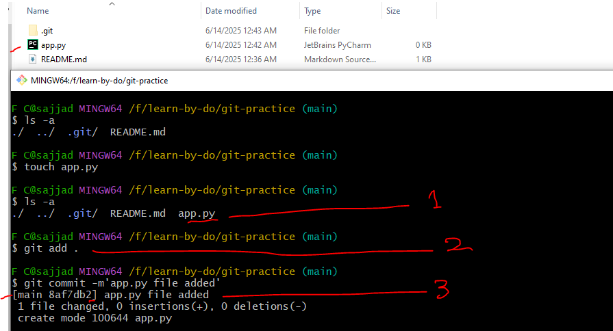
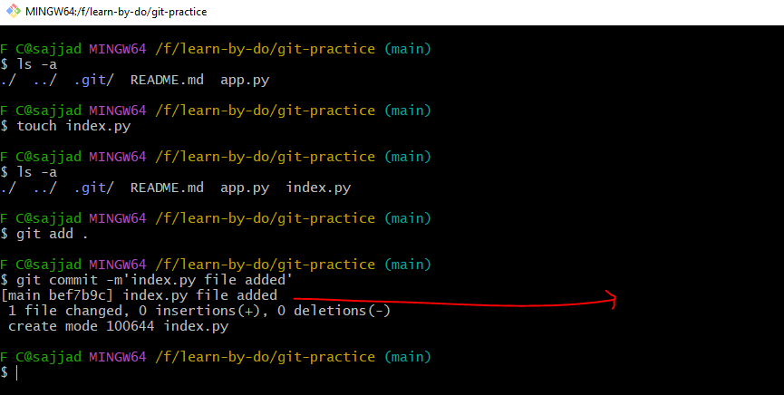
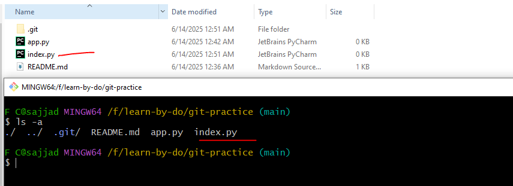
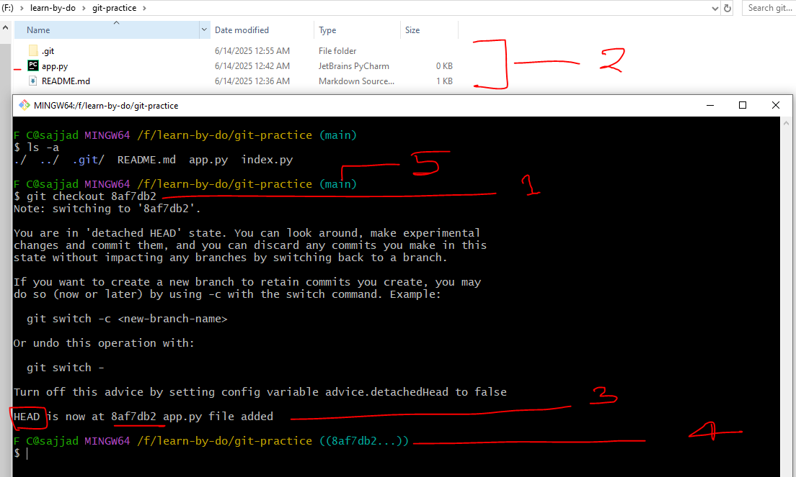
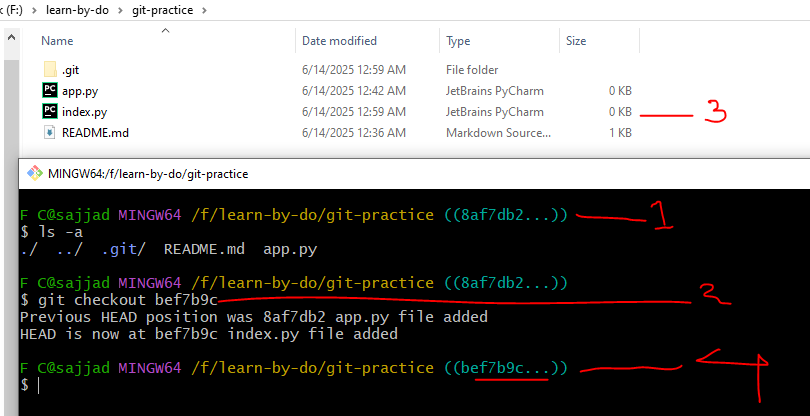

## 🔄 **Basic Git Workflow – Step by Step**

#### 1️⃣ **Working Tree (Working Directory)**

📝 This is where you **write and edit your code**.
Files here are not yet tracked or saved by Git.

#### 2️⃣ **`git add` → Staging Area (Index)**

📦 When you run `git add`, you're **moving selected file changes** into the **Staging Area**.
This means: "I’m preparing these files to be committed."

#### 3️⃣ **`git commit` → Local Repository**

🧱 When you run `git commit -m "message"`, Git takes the **staged changes** and:

* Creates a **snapshot**
* Assigns a unique **commit ID (SHA)**
* Stores it in your **Local Git Repository**

This is how Git tracks **version history**.

### 🧩 Simple Visualization

```
Working Tree → `git add` → Staging Area → `git commit` → Local Repository
```

### 🧪 Example 1: First Commit

I created a file called `app.py` and committed it.

```bash
git add app.py
git commit -m "app.py file added"
```

As shown in the output:

```bash
[main 8af7db2] app.py file added
```

Here, `8af7db2` is the **commit ID**.



---

### 🧪 Example 2: Second Commit

Next, I added another file named `index.py`:

```bash
git add index.py
git commit -m "index.py file added"
```

Output:

```bash
[main bef7b9c] index.py file added
```

The commit ID is now different: `bef7b9c`.



---

### 📂 Current State: Two Files

At this point, the repository on the `main` branch contains both:

* `app.py`
* `index.py`



---

### 🔙 Switching to an Older Commit

Now, let’s go back to the first commit using:

```bash
git checkout 8af7db2
```

After running the command, we inspect the working directory.



We now see **only `app.py` is present**, because this is the state of the project at that commit.
The `index.py` file is missing — and that’s expected.

Also note:

* Before checkout, `HEAD` pointed to `main` (latest commit).
* After checkout, `HEAD` points to the specific commit `8af7db2`.

---

### 🔁 Returning to the Latest Commit

To switch back to the latest state (i.e., the tip of the `main` branch):

```bash
git checkout main
```

Once done, both files (`app.py` and `index.py`) reappear.



---

### 🔍 Summary: Switching Between Commits

| Action                     | Description                                             |
| -------------------------- | ------------------------------------------------------- |
| `git checkout <commit-id>` | Moves the working directory to a specific snapshot      |
| `git checkout main`        | Returns you to the latest commit on the main branch     |
| `HEAD`                     | Always points to your current commit or branch location |


