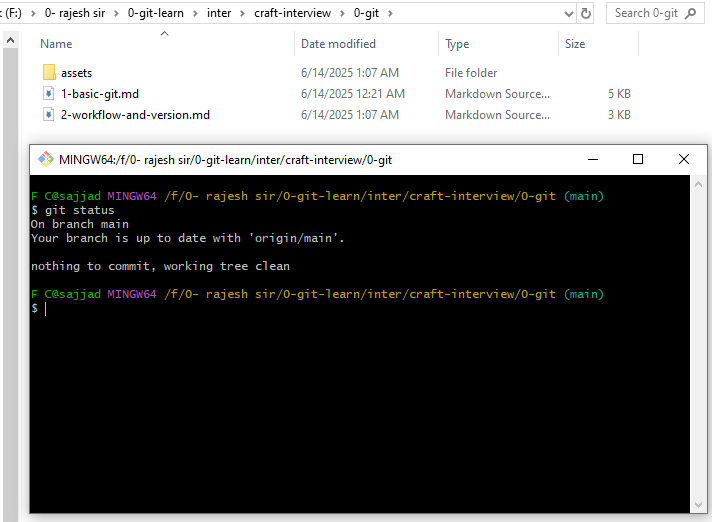
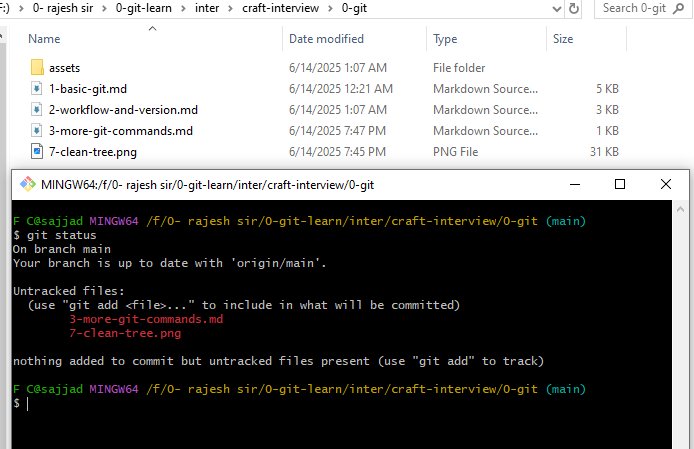
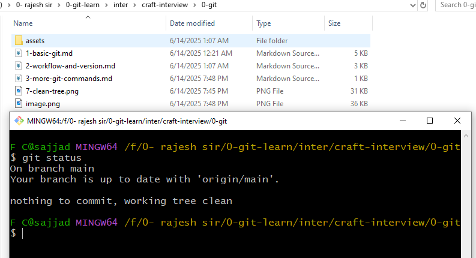
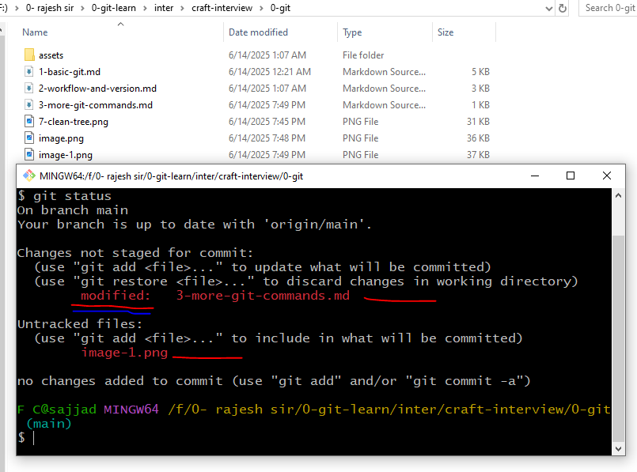
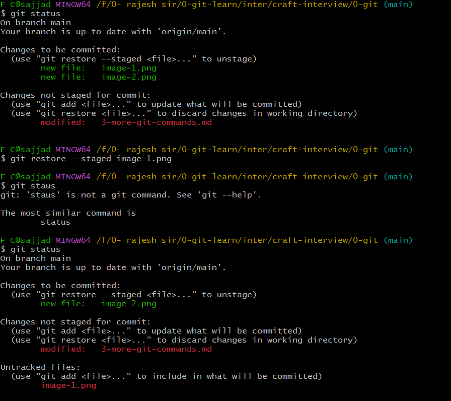

## 🧠 Understanding Git: Tracking, Status, and File Operations

### 🔍 What Does Git Always Do?

Git is a **content tracker** — it **always keeps track of changesets** (i.e., sets of changes made to files over time). This is how Git maintains a complete history of a repository.

Each Git project contains a hidden folder called `.git`, which stores all the metadata and history about the project.

---

### 📌 Checking the Status with `git status`

When you run:

```bash
git status
```

You’ll get a snapshot of:

* Which files are **staged** (ready to commit),
* Which files are **modified but not staged**, and
* Which files are **untracked** (new and not yet added to Git).

#### ✅ Clean Working Tree

If there are no new changes, Git will show:

```
nothing to commit, working tree clean
```

This means your local working directory matches the last commit on your branch.

🖼️ *Example Output:*


---

### 📝 Creating and Modifying Files

1. You create a file named `3-more-git-commands.md`
2. Run `git add 3-more-git-commands.md`
3. Then modify the file again.

🖼️ *Before and After Git Add:*




When modified after staging, Git will show:

```
modified: 3-more-git-commands.md
```

This means the file was staged, then modified again — it now has new changes in the working directory.

---

### 📁 Understanding Untracked Files

Untracked files = files Git **never saw before**
To track them, you need to run `git add`.

🖥️ Example Status After Adding & Modifying:

```bash
Changes to be committed:
  modified:   3-more-git-commands.md
  new file:   image-1.png
  new file:   image-2.png
```

---

### 📂 `git add` Behavior

| Command         | Meaning                                                     |
| --------------- | ----------------------------------------------------------- |
| `git add .`     | Adds changes in the **current folder only**                 |
| `git add --all` | Adds **all changes** across the repo (including subfolders) |

---

### 📜 Viewing History

To view the commit history:

```bash
git log
```

For a shorter version:

```bash
git log --oneline
```

---

### 📂 Git Tracks Files, Not Folders

> Git tracks **files** — not empty folders.
> To track a folder, add a placeholder file (e.g., `.gitkeep` or `README.md`).

---

### 🔄 Restore & Unstage Files

Sometimes you want to **unstage** files (move them from the staged area back to the working directory):

```bash
git restore --staged <filename>
```

🖼️ *Example:*


---

### 🔀 Cherry Pick vs. Rebase (Basic Idea)

* **Cherry-pick**: Apply specific commits from one branch to another.
* **Rebase**: Move or combine a sequence of commits to a new base commit (used for cleaner history).

---

### ⚙️ Example: Creating and Restoring Many Files

You create 100 markdown files:

```bash
touch ./docs/{1..100}.md
```

To remove them (unstage or clean up):

* Unstage one file:

```bash
git restore --staged ./docs/1.md
```

* Clean untracked files (including new directories):

```bash
git clean -fd ./docs/
```

> `-f` = force
> `-d` = include directories

