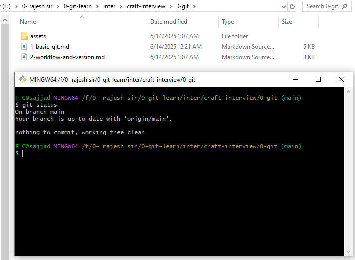
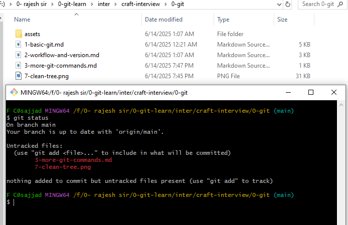

The repository main task is to take the history of a git.
each repostiory we can see `.git` folder which actully keep the history . 

What alwasy git did ? 
- alaways keep the changesets . Also git called conent tracker . 

now i have check the `git status ` command as there is no new file . It shows `nothing to commit, working tree clean` there is no new file created . Both the repo and local repo status same .

 

now i have created a file name `3-more-git-commands.md` it let see what it shows 

now i git add 3-more-git-commands and latter modify it 

