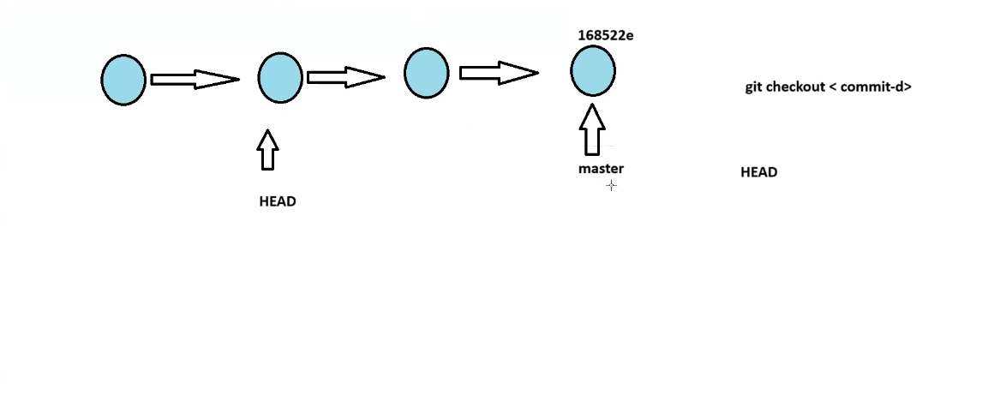
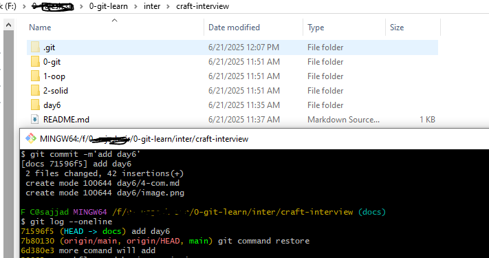

## 🧠 Git Reference Objects — Clear Definition

Git has **reference objects** (or refs) which are **pointers** to commits:

### 🔁 Types of Reference Objects:

* `HEAD`: Pointer to the current checked-out commit
* Branches: Pointers to commits (e.g., `main`, `docs`)
* Tags: Named pointers to specific commits (immutable)
* Remotes: Like `origin/main`, reflect server state

```bash
# To list all branches:
git branch

# Create a new branch:
git branch docs
```

---

## 🧭 HEAD vs Branch (like main/master)

### 🧷 HEAD:

* `HEAD` is your **current position** in the commit history.
* It can point to:

  * a branch (like `main`) → `HEAD is on branch`
  * a commit (like `7b80130`) → `HEAD is detached`

### 📌 Branches (like `main`, `master`):

* Branches are **named pointers** to commits.
* `main` or `master` typically points to the latest stable commit in a line of development.

---

## 🎯 Scenario: Detached HEAD vs HEAD on Branch

### ❓ What happens when you do:

```bash
git checkout 7b80130
```

You get:

```bash
HEAD detached at 7b80130
```

**Explanation:**

* You moved `HEAD` to point to an **older commit** (`7b80130`).
* But `main` or `master` still points to the latest commit — **it doesn't move**.
* This is called a **detached HEAD** state.

---

## 🔄 How to move `master` (or main) to where HEAD is?

### ✅ Solution: Force the branch to follow HEAD

If you're sure, and want `master` to point to the current `HEAD`:

```bash
git branch -f master
```

or

```bash
git checkout master
git reset --hard HEAD
```

> Be careful: this rewrites history if others are using this branch.

### ❗Deleting the latest commit is **not required** unless you want to remove changes.

🖼️📷 *Example:*


From your **first image**, `HEAD` moved back to an old commit, but `master` stayed.
You can fix this by **resetting `master`** to match `HEAD`.

From your **second image**, `docs` branch has new commits:

```bash
$ git log --oneline
71596f5 (HEAD -> docs) add day6
7b80130 (origin/main, origin/HEAD, main) git command restore
```

This means:

* `docs` branch has a new commit.
* `main` is behind — it doesn't include that commit yet.


🖼️📷 *Example:*


---

## 🔀 How to Merge `docs` into `main`?

### 🧪 Merge Steps:

1. Switch to target branch (where you want to bring changes):

```bash
git checkout main
```

2. Merge from the source branch (`docs`):

```bash
git merge docs
```

Now `main` includes all the commits from `docs`.

---

## ✅ To Sum Up

| Concept               | Explanation                                           |
| --------------------- | ----------------------------------------------------- |
| `HEAD`                | Current checked-out commit                            |
| `master` or `main`    | A named pointer to a commit                           |
| Detached HEAD         | When `HEAD` points directly to a commit, not a branch |
| Move `master` to HEAD | Use `git branch -f master` or `git reset --hard HEAD` |
| Merge branches        | `git merge <source>` from the target branch           |


