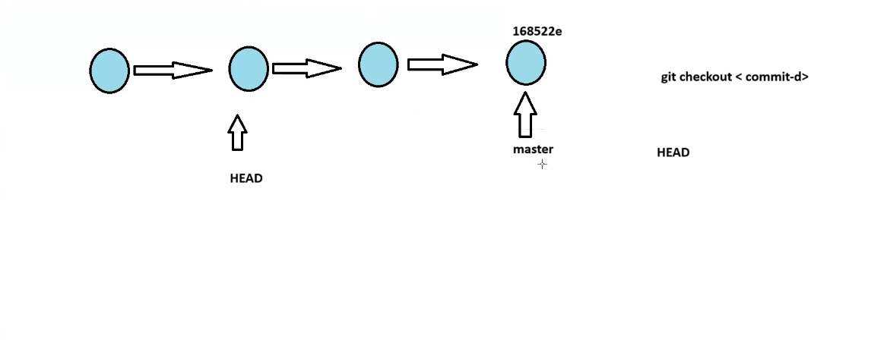
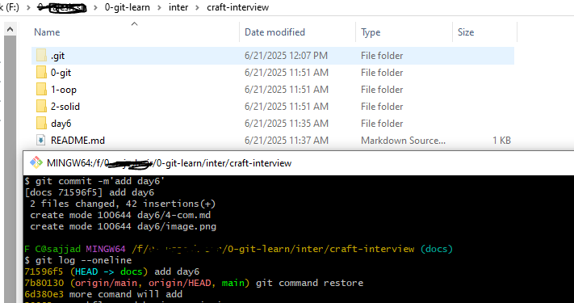

git had and master alsways together when i comes to the latest commint . when we do `git checkout coomt_id` it goes to back means previous commit , but the thing is that the master keep in the latest commit only move the head 

look at the picture 


if we want to master move along with head ? how it is possible ?

is possible by deleteing the latest commit 


## Git Reference Object 

- branches
- tags
- head
- remote
7b80130
REference objects are pointers which poitns to other reference or commit id 

Branches are created for having independent line of development 


lets list of Branches 

    `git branch`


to create a branch we can simple used this 
` git branch docs`

now check 
   ` git branch`

we get 
```git
F C@sajjad MINGW64 /f/0- ****/0-git-learn/inter/craft-interview/day6 ((7b80130...))       
$ git branch
* (HEAD detached at 7b80130)
  docs
  main
```

since we are createing another branches and find the info here 
```$ git log --oneline
71596f5 (HEAD -> docs) add day6
7b80130 (origin/main, origin/HEAD, main) git command restore
```



Marge is an operation to bring all the changes from one branch to another 

lets marge changes from the docs branh 


Target Branch : Master 
Source Branch : docs 
